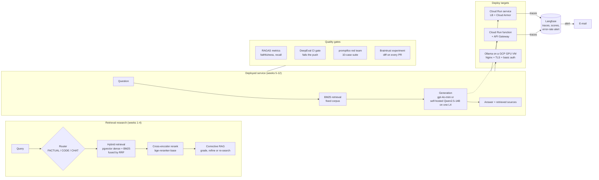

# Northwind RAG: retrieval research, eval gates, and three ways to deploy it

A 12-week build of a retrieval-augmented support assistant, done in the order a production team
would hit the problems: **find the right document -> measure whether answers are good -> block
regressions in CI -> deploy it -> watch it run.** Every number below was measured in this repo;
the caveats sit next to them.

## Architecture

Two lanes, because they are different systems. The retrieval lane is where the retrieval ideas
were built and benchmarked (Postgres + pgvector). The service lane is the smaller, fully
evaluated and deployed system (BM25 retrieval over a fixed documentation corpus, so every eval
is cheap and reproducible).



## Results

**Retrieval, week 1 (70-document corpus, 20 queries):**

| Retriever | recall@10 |
|---|---|
| BM25 only | 90% |
| Dense only (`bge-small-en-v1.5`) | 100% |
| Hybrid (dense + BM25, fused with RRF) | 100% |

**Reranking, week 2 (same corpus, 25 queries):**

| Pipeline | NDCG@10 | recall@10 | Added latency |
|---|---|---|---|
| Hybrid only (baseline) | 0.910 | 96% | none |
| Hybrid + `bge-reranker-base` | **0.945** (+0.035) | 100% | +166 ms / query |

The honest reading: dense retrieval alone already hit 100% recall here (its subword tokenizer
kept rare tokens recognisable), so hybrid's value did not show in the top-line number; reranking
is what recovered the one missed query, and one exact-token query got worse. See
`weeks/week-01-*` and `weeks/week-02-*`.

**Answer quality (RAGAS Faithfulness, judged by `gpt-4o-mini` for every row; week 11,
24 questions, retrieval hit 100% for all rows, so differences are generation only):**

| Generator | Faithfulness | p50 latency | Where it runs |
|---|---|---|---|
| `gpt-4o-mini` | **0.979** | 1.06 s | OpenAI API |
| Qwen2.5-14B-Instruct | **0.979** | 1.71 s | one NVIDIA L4 on a GCP VM |
| Llama 3.2 3B | 0.708 | 1.11 s | same GPU VM (CPU-only: ~14.6 s p50) |

24 questions on one synthetic documentation corpus is a real result and a small one: one flipped
answer moves the mean by ~0.04. Faithfulness measures "is the answer supported by the retrieved
text", not "is it correct".

**Cold start (week 10; 8 forced-cold requests, 40 warm):**

| Target | cold p50 | warm p50 |
|---|---|---|
| Cloud Run function (min instances 0) | 3.4 s | 0.96 s |
| Cloud Run service (min instances 0) | 4.2 s | 0.98 s |

**Release gates:** a DeepEval suite fails the push below Faithfulness 0.8 / Answer Relevancy 0.75 /
Contextual Recall 0.7; a 10-case promptfoo red-team suite initially failed 1 of 10 (an
internal-notes disclosure) and passed 10/10 after the system prompt was hardened; Braintrust diffs
every PR's scores against `main`.

## Observability

Every deployed target sends one trace per request to Langfuse, tagged with its own
`environment` (`cloud-run-service`, `cloud-run-function`). Each request also writes a boolean
`request_error` score, so `avg(request_error) > 0.02` over an hour **is** "error rate above 2%".
Langfuse alerts notify via Slack, webhook or GitHub Actions (not e-mail), so a small signed-webhook
relay (and a scheduled fallback poller) sends the e-mail. Code and tests: `weeks/week-12-*/project`.

## Run it

```bash
# any week's project is self-contained:
cd weeks/week-09-cloud-run-deployment/project && uv sync && uv run pytest -q

# deploy the service (Terraform: Cloud Run + load balancer + Cloud Armor), with tracing on
cd weeks/week-09-cloud-run-deployment/project
./scripts/build_and_push.sh && ENABLE_LANGFUSE=true PROJECT_ID=<id> ./scripts/deploy.sh

# deploy the function + service comparison (Terraform), then verify traces arrive
cd weeks/week-10-cloud-run-functions/project/terraform/scripts
ENABLE_LANGFUSE=true PROJECT_ID=<id> ./04_apply.sh
cd weeks/week-12-q1-wrapup-observability/project
uv run python scripts/verify_traces.py --target cloud-run-service=https://<lb>/chat --target cloud-run-function=https://<fn-url>/

# self-hosted model on a GPU VM (Terraform; costs money while it exists -- destroy when done)
cd weeks/week-11-ollama-vps-edge/project/terraform/scripts && ./00_check_gpu_quota.sh && ./01_bootstrap.sh && ./03_apply.sh
```

Each directory's own README has the details, prerequisites, and teardown commands.

## Repository map

| Weeks | Topic |
|---|---|
| 1, 1b, 1c | Hybrid search with RRF; chunking and embedding selection; ingestion and dedup |
| 2, 3, 4 | Cross-encoder reranking; ColBERT late interaction; query routing and corrective RAG |
| 5, 6, 7, 8 | RAGAS metrics; DeepEval CI gates; promptfoo red-teaming; Braintrust release gating |
| 9, 10 | Cloud Run deployment (Terraform, LB, Cloud Armor); Cloud Run functions vs service, cold-start benchmark |
| 11 | Self-hosted LLM: Ollama on a GCP GPU VM behind Nginx, load test, model comparison |
| 12 | Langfuse tracing on every target, error-rate alerting, this README |

## Limits worth knowing

- The corpus is a small synthetic documentation set; results are evidence about the method, not a
  benchmark of any model in general.
- The deployed service uses BM25 retrieval. Hybrid search, reranking, ColBERT and CRAG were built and
  measured separately (weeks 1-4) and are not in the deployed path.
- The faithfulness judge is an LLM (`gpt-4o-mini`); scores are comparable across rows (same judge)
  but are not ground truth.
- Alert delivery and live Langfuse reporting need your own Langfuse project and accounts; the code
  is tested against the real SDK and a capture server, and `verify_traces.py` checks a real deploy.
