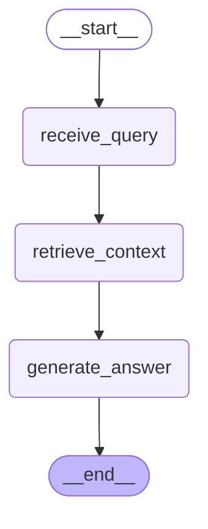

# Week 13 graph

Generated by `scripts/draw_graph.py` -- do not edit by hand.

```mermaid
---
config:
  flowchart:
    curve: linear
---
graph TD;
	__start__([<p>__start__</p>]):::first
	receive_query(receive_query)
	retrieve_context(retrieve_context)
	generate_answer(generate_answer)
	__end__([<p>__end__</p>]):::last
	__start__ --> receive_query;
	receive_query --> retrieve_context;
	retrieve_context --> generate_answer;
	generate_answer --> __end__;
	classDef default fill:#f2f0ff,line-height:1.2
	classDef first fill-opacity:0
	classDef last fill:#bfb6fc
```
